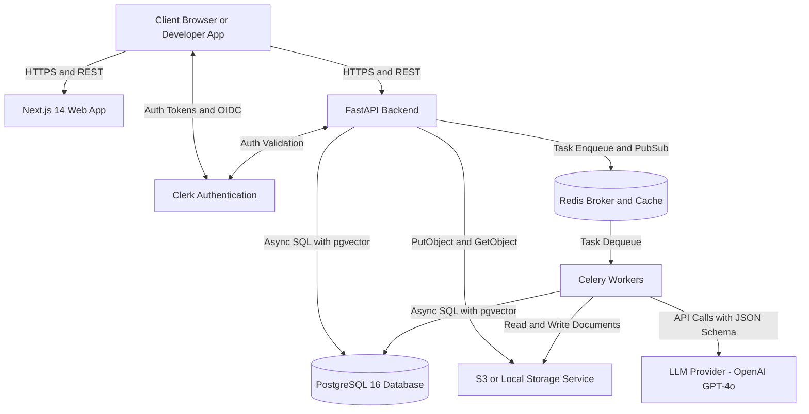
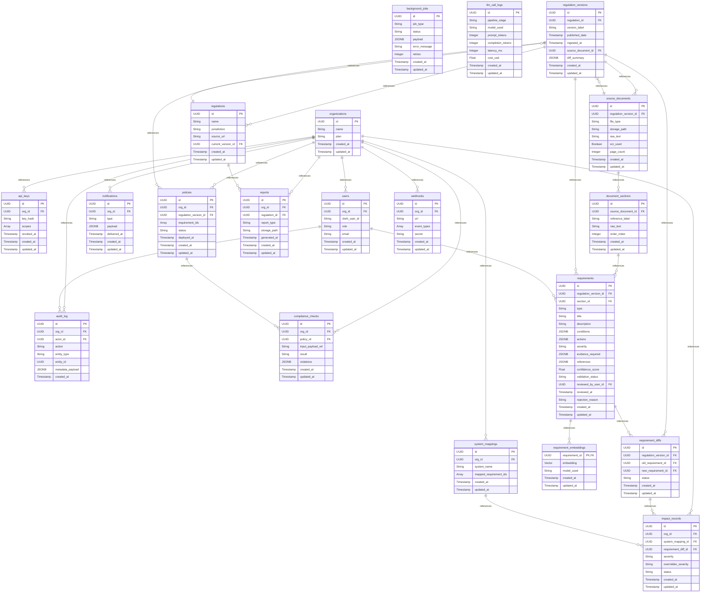
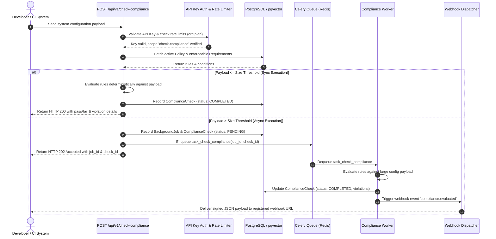
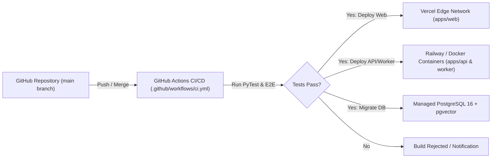

<div align="center">

# 

<a href="https://github.com/DenverCoder1/readme-typing-svg"></a>

<br />

[](https://github.com/rcrag/regulation-as-code-compiler/actions)
[](LICENSE)
[](https://github.com/rcrag/regulation-as-code-compiler/releases)
[](https://nextjs.org/)
[](https://fastapi.tiangolo.com/)
[](https://www.postgresql.org/)
[](https://github.com/pgvector/pgvector)
[](https://docs.celeryq.dev/)

</div>

<br />

## What is Regulation-as-Code Compiler?

**Regulation-as-Code Compiler** is an enterprise-grade compliance automation platform that ingests complex legal statutes, regulatory frameworks (GDPR, EU AI Act, SOC2, HIPAA), and internal governance documents, transforming them into structured, machine-readable rules and deterministic enforcement APIs. Unlike legacy governance tools or unstructured chat assistants, our compiler uses AI-powered semantic extraction combined with rigorous vector deduplication (`pgvector`) and human-in-the-loop validation to produce an **enforceable compliance graph**. Engineers and compliance officers can test system architectures in CI/CD pipelines via sub-millisecond API evaluations (`POST /api/v1/check-compliance`), generate cryptographically verifiable audit evidence, and automatically track system impact across regulatory amendments.

---

## 30-Second Demo

<!-- TODO: record demo.gif — see /docs/media/README.md for instructions -->
<div align="center">
  <p><em>End-to-end demo recording in progress. See <a href="./docs/media/README.md">/docs/media/README.md</a> for recording instructions and script.</em></p>
</div>

---

## System Architecture

The repository is organized as a unified monorepo running a high-performance **FastAPI** asynchronous backend coupled with a **Next.js 14 App Router** frontend, supported by **Celery** distributed workers and **PostgreSQL 16 + pgvector**.

### A. Top-Level System Overview



### B. Regulatory Ingestion Pipeline

Our multi-stage ingestion pipeline transforms unstructured regulatory text into structured, deduplicated compliance obligations:

```mermaid
graph LR
    Upload["1. Document Upload"] --> Extract["2. Text / OCR Extraction"]
    Extract --> Segment["3. Section Segmentation"]
    Segment --> Chunk["4. Semantic Chunking"]
    Chunk --> Classify["5a. LLM Classification"]
    Classify --> LLMExtract["5b. Structured Extraction"]
    LLMExtract --> Score["5c. Confidence Scoring"]
    Score --> Dedup["6. Vector Dedup & Embedding"]
    Dedup --> Route{"7. Validation Routing"}
    Route -->|Confidence < 0.7| Review["8a. Human Review (Pending)"]
    Route -->|Confidence >= 0.7| Auto["8b. Auto-Approved"]
    Review -->|Officer Approve| Approved["9. Approved & Enforceable Policy"]
    Auto --> Approved
```



### C. Database Schema (ERD)

> [!NOTE]
> **Auto-Generated Entity Relationship Diagram**  
> This diagram is generated directly from our declarative SQLAlchemy models using our introspection script:  
> `docker compose -f infra/docker-compose.yml exec -T api python scripts/generate_erd.py`  
> It represents the exact relational schema enforced in production.



### D. Request Sequence: Check-Compliance Evaluation

The developer check-compliance API supports both synchronous evaluation for lightweight system payloads and asynchronous queue offloading for large architectural manifests:



### E. Multi-Tenancy & RBAC Permission Matrix

Our role-based access control is enforced at the route level via strict dependency injection (`require_role`) in `app/core/auth.py`.

<details open>
<summary><b>View Role Permission Matrix</b></summary>
<br />

| User Role | Upload Regs | Review & Approve | System Mappings | API Keys & Users | Check Compliance API | Generate Reports | View Dashboard |
| :--- | :---: | :---: | :---: | :---: | :---: | :---: | :---: |
| **Admin** | :white_check_mark: | :white_check_mark: | :white_check_mark: | :white_check_mark: | :white_check_mark: | :white_check_mark: | :white_check_mark: |
| **Compliance Officer** | :white_check_mark: | :white_check_mark: | :x: | :x: | :white_check_mark: | :white_check_mark: | :white_check_mark: |
| **Legal Counsel** | :white_check_mark: | :white_check_mark: | :x: | :x: | :x: | :white_check_mark: | :white_check_mark: |
| **Risk Officer** | :x: | :x: | :white_check_mark: | :x: | :white_check_mark: | :white_check_mark: | :white_check_mark: |
| **Developer** | :x: | :x: | :white_check_mark: | :white_check_mark: (Keys only) | :white_check_mark: | :x: | :white_check_mark: |
| **Auditor** | :x: | :x: | :x: | :x: | :x: | :white_check_mark: (Read only) | :white_check_mark: |
| **Viewer** | :x: | :x: | :x: | :x: | :x: | :x: | :white_check_mark: |

</details>

---

## Technology Stack

Our production stack is curated for low-latency rule evaluation, deterministic document generation, and enterprise multi-tenancy:

| Layer | Technology | Version | Rationale & Architectural Purpose |
| :--- | :--- | :---: | :--- |
| **Frontend Framework** | Next.js | `14.2.35` | React Server Components (RSC) and App Router for dynamic SSR and static optimization. |
| **Styling & UI** | Tailwind CSS & Shadcn UI | `3.4.1` / `4.15.0` | Restrained Vercel/Linear dark theme aesthetic with accessible primitives. |
| **3D Visualizations** | Three.js & React Three Fiber | `0.185.1` / `9.6.1` | Interactive, restrained compilation meshes for visualizing regulatory structures. |
| **Authentication** | Clerk (`@clerk/nextjs`) | `7.6.1` | Seamless enterprise multi-tenancy, JWT session validation, and organization scoping. |
| **Backend Framework** | FastAPI (Python) | `0.110.0` | High-performance asynchronous REST API with built-in Pydantic validation & OpenAPI docs. |
| **Database & ORM** | PostgreSQL & SQLAlchemy | `16.0` / `2.0.31` | ACID compliance and async ORM (`asyncpg`) with Alembic database migrations. |
| **Vector Database** | `pgvector` | `0.2.5` | Native PostgreSQL extension for embedding similarity searches and obligation deduplication. |
| **Task Queue** | Celery & Redis | `5.4.0` / `5.0.3` | Distributed asynchronous workers for OCR extraction, LLM pipelines, and webhook dispatch. |
| **LLM Integration** | OpenAI / Tiktoken | `1.52.0` / `0.8.0` | Structured JSON extraction of legal conditions, actions, and evidence requirements. |
| **Document Processing** | PyMuPDF & pytesseract | `1.24.4` / `0.3.10` | High-speed PDF text parsing and fallback optical character recognition for scanned docs. |
| **Observability** | Sentry SDK & JSON Logging | `2.66.1` / `4.1.0` | Real-time error tracking and context-aware structured JSON logging (`request_id` propagation). |

---

## Repository Structure

```text
regulation-as-code-compiler/
├── .github/
│   └── workflows/                # CI/CD pipelines (PyTest test runners, code linting)
├── apps/
│   ├── api/                      # FastAPI backend application & Celery workers
│   │   ├── app/
│   │   │   ├── api/routers/      # REST endpoints (regulations, requirements, policies, check-compliance)
│   │   │   ├── core/             # Security hardening, JWT auth, RBAC, structured logging, storage
│   │   │   ├── db/               # Async SQLAlchemy engine, session management, repositories
│   │   │   ├── models/           # Declarative database schemas (16 core tables)
│   │   │   ├── pipelines/        # AI ingestion (extract, chunk, LLM extract, dedup) & PDF reports
│   │   │   ├── schemas/          # Pydantic data validation schemas and serialization models
│   │   │   └── worker/           # Celery asynchronous worker setup and background tasks
│   │   ├── scripts/              # Automation tools (dynamic Mermaid ERD generator)
│   │   └── tests/                # Unit tests, regression suites, and extraction quality tests
│   └── web/                      # Next.js 14 App Router web frontend
│       ├── app/                  # Public landing pages, dashboard, reports, and admin UI
│       ├── components/           # Reusable UI components, interactive requirement browsers, diffs
│       └── lib/                  # Clerk authentication helpers and API client utilities
└── infra/                        # Infrastructure definitions, Docker Compose, database init scripts
```

---

## Getting Started

Follow these exact commands to spin up the complete full-stack compiler locally in Docker:

### 1. Clone & Configure Environment
```bash
git clone https://github.com/rcrag/regulation-as-code-compiler.git
cd regulation-as-code-compiler

# Copy example environment files
cp apps/api/.env.example apps/api/.env
cp apps/web/.env.example apps/web/.env
```

<details>
<summary><b>Required Environment Variables (apps/api/.env)</b></summary>
<br />

```ini
ENVIRONMENT="development"
LOG_LEVEL="INFO"
DATABASE_URL="postgresql+asyncpg://postgres:postgres@db:5432/regulation_compiler"
REDIS_URL="redis://redis:6379/0"
OPENAI_API_KEY="sk-your-openai-api-key"
CLERK_SECRET_KEY="sk_test_your_clerk_secret"
SENTRY_DSN="" # Optional for local dev
```

</details>

### 2. Launch Services with Docker Compose
```bash
docker compose -f infra/docker-compose.yml up --build -d
```
This starts PostgreSQL 16 (with `pgvector`), Redis, the FastAPI backend on port `8000`, Celery worker processes, and the Next.js web app on port `3000`.

### 3. Run Database Migrations & Verify Health
```bash
# Execute Alembic migrations to construct all 16 database tables and pgvector extension
docker compose -f infra/docker-compose.yml exec api alembic upgrade head

# Verify deep system health (Database, Redis broker, and Worker connectivity)
curl http://localhost:8000/api/health
```
Expected response: `{"status": "healthy", "database": "connected", "redis": "connected", "worker": "responsive"}`

---

## Testing & Quality Assurance

We enforce strict test coverage across our deterministic pipelines and API endpoints:

### Running Backend Unit & Integration Tests
```bash
docker compose -f infra/docker-compose.yml exec api pytest -v
```

### Golden Dataset Extraction Regression Test
To prevent silent LLM prompt regressions or model drift from breaking legal obligation extraction, we maintain a curated regression suite against a golden regulatory dataset:
```bash
docker compose -f infra/docker-compose.yml exec api pytest tests/test_extraction_quality.py -v
```
This test asserts that extraction accuracy, obligation classification, and confidence scoring remain strictly above our `95%` precision threshold across model updates.

---

## API Reference

The FastAPI backend automatically serves OpenAPI documentation:
* **Interactive Swagger UI**: [http://localhost:8000/docs](http://localhost:8000/docs)
* **ReDoc Reference**: [http://localhost:8000/redoc](http://localhost:8000/redoc)

### Example 1: Upload a Regulation for Compilation
```bash
curl -X POST "http://localhost:8000/api/v1/regulations/upload" \
  -H "Authorization: Bearer <clerk_jwt_token>" \
  -F "file=@./GDPR_Official_Text.pdf" \
  -F "name=General Data Protection Regulation" \
  -F "jurisdiction=European Union"
```

### Example 2: Evaluate System Compliance against Active Policy
```bash
curl -X POST "http://localhost:8000/api/v1/check-compliance" \
  -H "X-API-Key: sk_live_your_scoped_developer_key" \
  -H "Content-Type: application/json" \
  -d '{
    "system_name": "User-Service-Authentication",
    "configuration": {
      "data_retention_days": 30,
      "encryption_at_rest": "AES-256",
      "user_consent_recorded": true,
      "third_party_sharing": false
    }
  }'
```

---

## Deployment Architecture

In production, frontend application bundles are deployed globally on the **Vercel Edge Network**, while asynchronous backend API instances, Celery workers, and managed PostgreSQL databases are isolated within VPC containers on **Railway** / **AWS ECS**.



---

## Master Build Roadmap & Status

Our compiler development is structured across 15 rigorous phases. Every completed phase is backed by an extensive verification suite and end-to-end audit:

- [x] **Phase 0**: Base monorepo scaffold, Docker Compose orchestration & environment setup
- [x] **Phase 1**: Declarative database schema, SQLAlchemy models & Alembic migrations
- [x] **Phase 2**: Multi-tenancy authentication & RBAC dependency injection (`@clerk/nextjs` + FastAPI)
- [x] **Phase 3**: Regulatory document upload, storage services & OCR preprocessing (`PyMuPDF` / `tesseract`)
- [x] **Phase 4**: Section segmentation & semantic chunking pipeline
- [x] **Phase 5**: LLM structured extraction, confidence scoring, `pgvector` dedup & embeddings
- [x] **Phase 6**: Interactive requirement browser & human-in-the-loop compliance review workflow
- [x] **Phase 7**: Executive dashboard, severity breakdown charts & real-time analytics
- [x] **Phase 8**: Deterministic reporting engine, server-side PDF generation & signed URLs
- [x] **Phase 9**: Developer API, token-bucket rate limiting, scoped API keys & `/check-compliance`
- [x] **Phase 10**: Regulation versioning, semantic similarity diff engine & amendment change tracking
- [x] **Phase 11**: System mappings CRUD, impact analysis records & notification dispatch groundwork
- [x] **Phase 12**: Asynchronous processing (Celery + Redis workers), dead-letter queues & webhook delivery
- [x] **Phase 13**: High-performance search (combined GIN full-text keyword + pgvector semantic vector search)
- [x] **Phase 14**: Observability (`sentry-sdk`, JSON logging, request tracing), security hardening & CI/CD deployment

---

## License & Contributing

**Proprietary / Y Combinator Winter 2026 Submission**  
This repository and its underlying regulatory compilation algorithms contain proprietary intellectual property. It is currently licensed for internal YC evaluation and review only. Unlicensed copying, distribution, or commercial exploitation is strictly prohibited.

For internal team contributions, please ensure all new pipeline stages include corresponding unit tests in `apps/api/tests/` and run the ERD generator script before opening a pull request.
